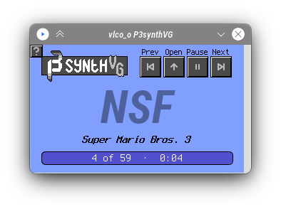

# vavi-sound-emu

java port game music emu. mavenized and spi-zed also. 

| name | description | status | comment |
|------|-------------|--------|----|
| gbs  | Game Boy    | TBD    | |
| nsf  | NES         | TBD    | |
| spc  | SNES        | TBD    | |
| vgm  | Mega Drive  | ✅      | |

## References

 * https://github.com/GeoffWilson/VGM
 * https://github.com/libgme/game-music-emu

## TODO

 * ~~make those using service loader~~

---

# [Original](https://github.com/vlcoo/P3synthVG)

---

A VGM player program created with *Processing*.
Supports playback of VGM, NSF and other equivalent files.

Due to many hiccups, development of P3synthVG has been prematurely finished.

Instead of becoming a VGM visualizer and inspector, this program will remain as a simple proof of concept player.
